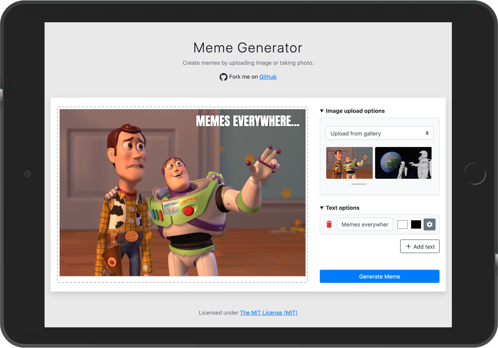

  

<h1 align="center">Meme Generator</h1>

A Progressive Web App (PWA) for creating memes.

## Features

Create a meme with by:
- Selecting an image from your device
- Selecting an image from the web (by URL)
- Selecting an image from the gallery
- Taking a photo with your device's web camera

## Screenshots

## License

[The MIT License (MIT)](https://georapbox.mit-license.org/@2019)
